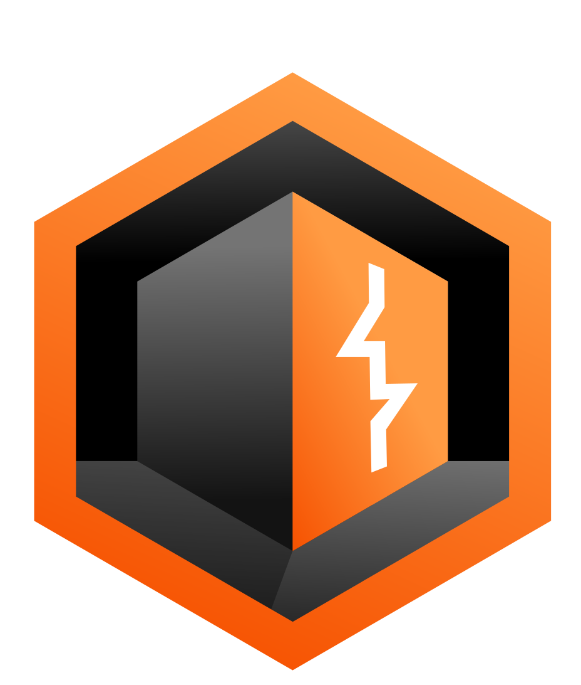
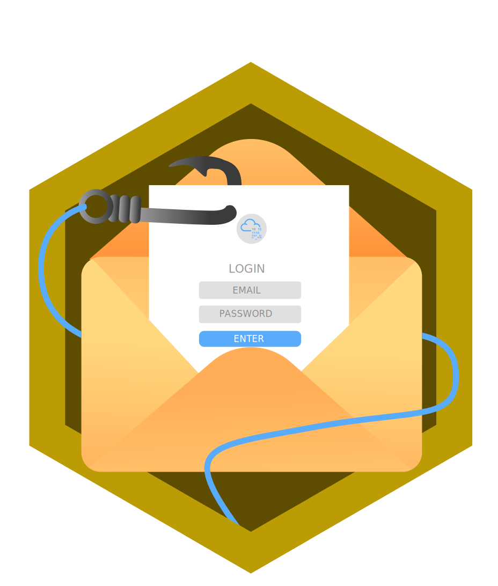

# 👨‍💻 Mahar Hassain K K - Cybersecurity Analyst

Welcome to my GitHub portfolio! I'm a passionate cybersecurity professional specializing in SOC analysis, with a strong background in security operations and penetration testing. My journey in cybersecurity is fueled by a continuous thirst for knowledge and a dedication to making the digital world a safer place.

With hands-on experience in monitoring and responding to security incidents using tools like Splunk and various vulnerability assessment platforms, I am committed to identifying and mitigating threats. Ranked in the top 1% on TryHackMe and among the top 50 in the UAE, I aim to contribute to meaningful cybersecurity projects and share knowledge with the community, particularly in the realm of SOC operations.

*"This portfolio is a work in progress, and I will continue to update it with new projects, skills, and certifications as I grow in my cybersecurity career."*

## 🔐 About Me

- **Name:** Mahar Hassain K K
- **Role:** Cybersecurity Analyst | SOC Analyst | Penetration Tester
- **Experience:** 1 years in Cybersecurity
- **Location:** Dubai, United Arab Emirates
- **Specializations:** Security Operations Center • SIEM • VAPT • Compliance Management • Cyber Threat Intelligence (CTI)

- **Email:** Maharkk01@gmail.com
- **LinkedIn:** [LinkedIn-Profile](https://www.linkedin.com/in/maharkk/)
- **Medium Blog/Writeups:** [Medium-Maharkk](https://medium.com/@maharkk01)
- **Current Focus:** Working on enhancing my skills in SOC analysis, with a strong passion for safeguarding critical systems and responding to security incidents.

## Education 🎓

**B.Tech in Computer Science (Honors), Major: Cybersecurity**  
Lovely Professional University, Punjab, India  
Graduated: 2023  
CGPA: 7.41 / 10  

## Experience 💼

**Cybersecurity Trainee: SOC Analyst**  
Red Team Hacker Academy, Kerala, India  
Duration: 7 months  

- Gained hands-on experience in security operations, monitoring, incident response, and penetration testing.
- Conducted vulnerability assessments and simulated attacks to evaluate system security.
- Worked with various tools and techniques for threat detection, analysis, and ethical hacking.

**Cybersecurity Intern**  
Prodigy InfoTech (Remote)  
Duration: 1 months 

- Working on practical cybersecurity projects, including encryption tools, password complexity checkers, keyloggers, and network packet analyzers.
- Gaining hands-on experience in encryption techniques, network security, and ethical hacking.
- Contributing to the development of security tools and techniques for real-world application.
  
## 🏆 TryHackMe

- **Profile:** [TryHackMe - Maharkk](https://tryhackme.com/p/Maharkk)

🏆= Rank 🔥= Streak 🏅= Badges Earned 🚪= Rooms Completed 

🏅**Notable Badges Acquired**

    <figure style="display: inline-block; text-align: center; margin: 10px;">
        
        <figcaption>90 Day Streak</figcaption>
    </figure>
    <figure style="display: inline-block; text-align: center; margin: 10px;">
        
        <figcaption>Owasp Top 10</figcaption>
    </figure>
    <figure style="display: inline-block; text-align: center; margin: 10px;">
        
        <figcaption>Mr. Robot</figcaption>
    </figure>
    <figure style="display: inline-block; text-align: center; margin: 10px;">
        
        <figcaption>Linuxpriesc</figcaption>
    </figure>
    <figure style="display: inline-block; text-align: center; margin: 10px;">
        
        <figcaption>Hash Cracker</figcaption>
    <figure style="display: inline-block; text-align: center; margin: 10px;">
        
        <figcaption>Burp Suite</figcaption>
    </figure>
       <figure style="display: inline-block; text-align: center; margin: 10px;">
        
        <figcaption>FlareVM</figcaption>
    </figure>
        <figure style="display: inline-block; text-align: center; margin: 10px;">
        
        <figcaption>Phishing</figcaption>
    </figure>
    </figure>

## 🛠️ Skills

### 🔍 Cybersecurity Skills
# Cybersecurity Skills

## Security Operations
- Expertise in SIEM, SOC monitoring, log analysis, Snort, osquery, and security automation.

## Threat Hunting
- Skilled in techniques and tools like Splunk, Yara, Sysmon, Wazuh, Zeek, and Brim.

## Incident Response
- Hands-on experience with incident handling, response strategies, threat detection, and recovery processes.

## Cyber Threat Intelligence
- Proficient in identifying, analyzing, and responding to emerging threats.

## Vulnerability Assessment
- Experienced with tools such as OpenVAS, Nessus, WPScan, and Arachni.

## Penetration Testing
- Proficient in Metasploit Framework, Burp Suite, Nmap, Wireshark, NetworkMiner, and John the Ripper.

## Additional Skills
- Malware Analysis, Digital Forensics, Phishing Analysis, and Compliance Management.

### 💻 Programming & Scripting

- **Languages:**
  - **Python:** Automation, scripting, and development of security tools.
  - **Bash:** Scripting in Unix/Linux environments and automation tasks.
  - **PowerShell:** Windows system administration and scripting.
  - **JavaScript:** Web application security assessments.
  - **SQL:** Database querying and security testing.

### 🖥️ Operating Systems

- **Windows:** Extensive experience with various versions for penetration testing, incident response, and system administration.
- **Linux:** Proficient in distributions such as Kali Linux, Parrot, and Ubuntu for security assessments, scripting, and server management.

## 🗂️ Projects

### 1. **Pixel Manipulation for Image Encryption**
   - **Description:** Developed a simple image encryption tool using pixel manipulation techniques. The tool allows users to encrypt and decrypt images by performing operations like swapping pixel values or applying a basic XOR operation to each pixel. This project demonstrates basic image encryption and decryption methods, showcasing practical applications of pixel-level manipulations in image security.
   - **Tools Used:** Python, PIL (Pillow), NumPy
   - **GitHub Repo:** [GitHub repository](https://github.com/Maharkk/PRODIGY_CS_02.git)

### 2. **Network Packet Analyzer**
   - **Description:** Developed a packet sniffer tool that captures and analyzes network packets, displaying relevant information such as source and destination IP addresses, protocols, and payload data. The tool ensures ethical use by including a disclaimer and obtaining user consent before starting packet capture. This project demonstrates practical skills in network monitoring and packet analysis for educational purposes.
   - **Tools Used:** Python, Scapy
   - **GitHub Repo:** [GitHub repository](https://github.com/Maharkk/PRODIGY_CS_05.git)

### 3. **Caesar Cipher Implementation**
   - **Description:** Created a Python program that implements the Caesar Cipher algorithm for encrypting and decrypting text. The program allows users to input a message and a shift value to perform both encryption and decryption operations. This tool demonstrates the basic principles of classical encryption techniques and provides a practical example of how to apply the Caesar Cipher in text processing.
   - **Tools Used:** Python
   - **GitHub Repo:** [GitHub repository](https://github.com/Maharkk/PRODIGY_CS_01.git)

## 🎓 Certifications

- **Certified SOC Analyst (CSA)**
  - *EC-Council* - 2024
  - [Certificate](Certificates/CSA.png) 

- **Certified IT Infrastructure and Cyber SOC Analyst V3 (CICSA)**
  - *Red Team Hacker Academy* - 2024
  - [Certificate](Certificates/CICSA.png) 

- **SOC Level 1**
  - *TryHackMe* - 2024
  - [Certificate](https://tryhackme-certificates.s3-eu-west-1.amazonaws.com/THM-ZGCCDBP3SI.pdf) 

- **Jr Penetration Tester**
  - *TryHackMe* - 2024
  - [Certificate](https://tryhackme-certificates.s3-eu-west-1.amazonaws.com/THM-S02KMVWSLL.png)

- **Learn Ethical Hacking From Scratch 2024** 
  - *zSecurity, Udemy* - 2024
  - [Certificate](https://www.udemy.com/certificate/UC-a9e20ef9-f8e6-4189-a9e8-e121a409daf9/)

## 🏆 Achievements

### Top 1% on TryHackMe
- **Rank:** Achieved a position in the top 1% of users globally and among the top 50 in the UAE.
- **Level:** Currently at max Level: GOD.
- **Highlights:** Successfully completed various learning paths, maintained a consistent streak for over Five months, and earned numerous badges for achievements and milestones. TryHackMe's hands-on challenges have been pivotal in advancing my cybersecurity skills.

### UHRS (Universal Human Relevance System)
- **Tasks Completed:** Over 5,000 tasks.
- **Skills Demonstrated:** Data analysis, security, and attention to detail.
- **Recognition:** Received incentives for the successful completion of bug bounties and data labeling tasks, showcasing my commitment to meticulous work.

### EPAM Systems
- **Internship Duration:** 6 months.
- **Focus Areas:** Cloud technologies and DevOps practices.
- **Skills Acquired:** Enhanced proficiency in Agile Methods, AWS, Docker, Terraform, and other cloud and DevOps tools.
- **Experience:** Gained hands-on experience and contributed to real-world projects, improving my understanding of cloud infrastructure and development practices.

## 📜 Blogs & Write-Ups

Explore more of my insights and analyses on cybersecurity and related topics on my [Medium profile](https://medium.com/@maharkk01). Below are a few highlighted pieces:

- **How TryHackMe Transformed My Cybersecurity Journey - Blog**  
  A deep dive into learning paths, streaks, badges, and global ranking.  
  [Read More](https://medium.com/@maharkk01/how-tryhackme-transformed-my-cybersecurity-journey-a-deep-dive-into-learning-paths-streaks-eef1d6cdaa5a)

- **Exploiting PHP Loose Comparison Vulnerabilities: The Magic Hash Attack(Web)**  
  Explore The Magic Hash Attack exploits PHP's loose comparisons, enabling attackers to bypass security checks using specific hash values.  
  [Read More](https://medium.com/@maharkk01/exploiting-php-loose-comparison-vulnerabilities-the-magic-hash-attack-web-61e92407d134)

- **Exploiting the NAPPING 1.0.1 VulnHub Machine: A Comprehensive Guide**  
  The successful exploitation of the NAPPING: 1.0.1 VulnHub machine illustrates the intricacies of penetration testing
  [Read More](https://medium.com/@maharkk01/exploiting-the-napping-1-0-1-vulnhub-machine-a-comprehensive-guide-1ef5e51ca53c)
  
*For the latest and more comprehensive content, visit my Medium profile regularly for updates.*

## 🌱 Learning & Development

I am committed to continuous improvement and staying at the forefront of cybersecurity. In the near future, I plan to focus on the following areas:

- **SOC Operations:** Deepening my understanding of Security Operations Center (SOC) processes, including incident detection, analysis, and response.
- **Advanced Penetration Testing:** Enhancing skills in sophisticated attack techniques and exploitation methods.
- **Cloud Security:** Gaining deeper knowledge of securing cloud environments and understanding cloud security best practices.
- **DevSecOps:** Integrating security practices into DevOps processes to ensure robust and secure software development.
- **Threat Intelligence:** Developing expertise in gathering, analyzing, and applying threat intelligence to enhance security posture.
- **Attacking and Defending AWS:** Building skills in securing and attacking Amazon Web Services (AWS) environments to better understand cloud vulnerabilities and defenses.

*I am eager to apply these skills and knowledge to future projects and challenges.*

## 🤝 Let's Connect

I'm always open to discussing cybersecurity, sharing knowledge, and collaborating on projects. Feel free to reach out to me via [LinkedIn](https://www.linkedin.com/in/maharkk/), [Email](mailto:maharkk01@gmail.com), or [Medium](https://medium.com/@maharkk01).

---

*This portfolio is a work in progress, and I will continue to update it with new projects, skills, and certifications as I grow in my cybersecurity career.*

