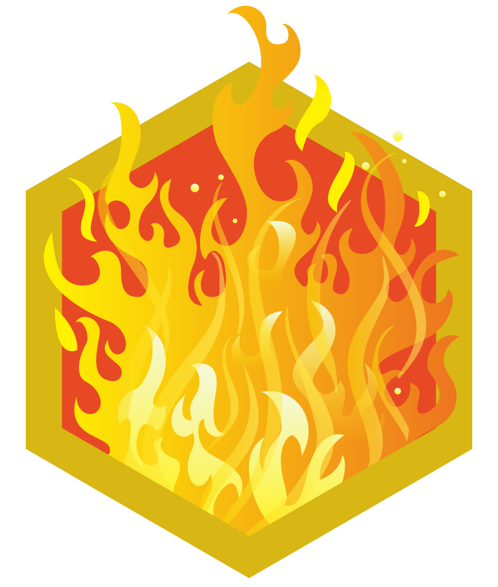
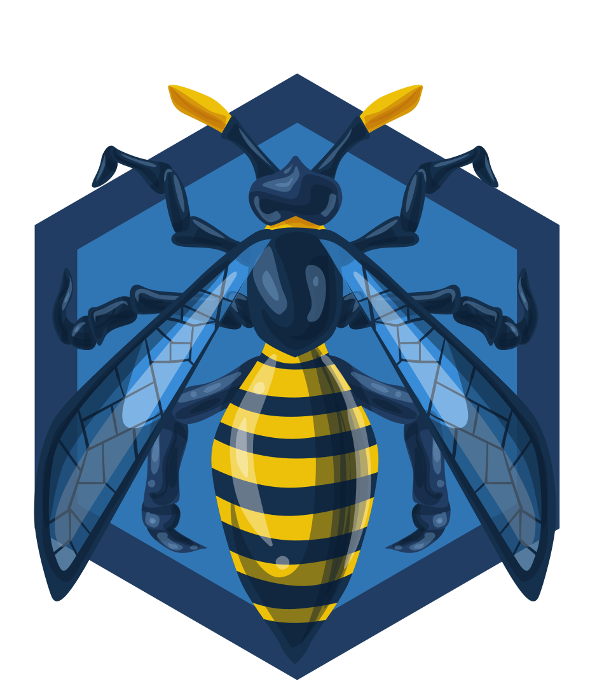

# 👨‍💻 Mahar Hassain K K - Cybersecurity Professional

Welcome to my GitHub portfolio! I'm a passionate cybersecurity professional with a strong background in security operations, penetration testing, and SOC Analysis. My journey in cybersecurity is driven by a continuous thirst for knowledge and a dedication to making the digital world a safer place.

## 🔐 About Me

- **Name:** Mahar Hassain K K
- **Role:** Cybersecurity Professional | SOC Analyst | Penetration Tester
- **Experience:** 1 years in Cybersecurity
- **Location:** Kerala, India
- **Email:** Maharkk01@gmail.com
- **LinkedIn:** [Maharkk](https://www.linkedin.com/in/maharkk/)
- **Medium Blog/Writeups:** [Maharkk](https://medium.com/@maharkk01)

## Education 🎓

**B.Tech in Computer Science (Honors), Major: Cybersecurity**  
Lovely Professional University, Punjab, India  
Graduated: 2023  
CGPA: 7.41 / 10  

## Experience 💼

**SOC Analyst & Pen Tester Trainee**  
Red Team Hacker Academy, Kerala, India  
Duration: 6 months  

- Gained hands-on experience in security operations, monitoring, incident response, and penetration testing.
- Conducted vulnerability assessments and simulated attacks to evaluate system security.
- Worked with various tools and techniques for threat detection, analysis, and ethical hacking.

## 🏆 TryHackMe

- **Profile:** [TryHackMe - Maharkk](https://tryhackme.com/p/Maharkk)

 
🏆= Rank  🚪= Rooms Completed  🎯= Badges Earned

🏅**Notable Badges Acquired**

    <figure style="display: inline-block; text-align: center; margin: 10px;">
        
        <figcaption>90 Day Streak</figcaption>
    </figure>
    <figure style="display: inline-block; text-align: center; margin: 10px;">
        
        <figcaption>Owasp Top 10</figcaption>
    </figure>
    <figure style="display: inline-block; text-align: center; margin: 10px;">
        
        <figcaption>Mr. Robot</figcaption>
    </figure>
    <figure style="display: inline-block; text-align: center; margin: 10px;">
        
        <figcaption>Linuxpriesc</figcaption>
    </figure>
    <figure style="display: inline-block; text-align: center; margin: 10px;">
        
        <figcaption>Hash Cracker</figcaption>
    </figure>

## 🛠️ Skills

### 🔍 Cybersecurity Skills
- **Penetration Testing:** Tools like Metasploit, Burp Suite, Nmap, etc.
- **Threat Hunting:** Threat Hunting techniques and tools
- **Incident Response:** Experience with incident handling and response
- **Vulnerability Assessment:** Experience with vulnerability scanning and assessment
- **Security Operations:** SIEM, SOC monitoring, log analysis

### 💻 Programming & Scripting
- **Languages:** Python, Bash, PowerShell, etc.

### 🖥️ Operating Systems
- **Linux:** Experience with various Linux distributions
- **Windows:** Experience with Windows environments

## 🗂️ Projects

### 1. **[Project Name]**
   - **Description:** [Brief description of the project and its significance]
   - **Tools Used:** [List of tools used in the project]
   - **GitHub Repo:** [Link to the GitHub repository]

### 2. **[Project Name]**
   - **Description:** [Brief description of the project and its significance]
   - **Tools Used:** [List of tools used in the project]
   - **GitHub Repo:** [Link to the GitHub repository]

### 3. **[Project Name]**
   - **Description:** [Brief description of the project and its significance]
   - **Tools Used:** [List of tools used in the project]
   - **GitHub Repo:** [Link to the GitHub repository]

## 🎓 Certifications

- **Learn Ethical Hacking From Scratch 2024** 
  - *zSecurity, Udemy* - 2024
  - [Learn Ethical Hacking From Scratch 2024](https://www.udemy.com/certificate/UC-a9e20ef9-f8e6-4189-a9e8-e121a409daf9/)

- **SOC Level 1** 
  - *TryHackMe* - 2024
  -  <!-- Replace with the actual path to your certificate image -->

- **Certified IT Infrastructure and Cyber SOC Analyst V3 (CICSA)** 
  - *Red Team Hacker Academy* - 2024
  -  <!-- Replace with the actual path to your certificate image -->

## 🏆 Achievements

  
Top 7% on TryHackMe

  <ul>
    <li><strong>Rank:</strong> Achieved a position in the top 7% of users globally.</li>
    <li><strong>Level:</strong> Currently at Level 8: Hacker, working towards the next level, Omni.</li>
    <li><strong>Highlights:</strong> Successfully completed various learning paths, maintained a consistent streak for over three months, and earned numerous badges for achievements and milestones. TryHackMe's hands-on challenges have been pivotal in advancing my cybersecurity skills.</li>
  </ul>

  
UHRS (Universal Human Relevance System)

  <ul>
    <li><strong>Tasks Completed:</strong> Over 5,000 tasks.</li>
    <li><strong>Skills Demonstrated:</strong> Data analysis, security, and attention to detail.</li>
    <li><strong>Recognition:</strong> Received incentives for the successful completion of bug bounties and data labeling tasks, showcasing my commitment to meticulous work.</li>
  </ul>

  
EPAM Systems

  <ul>
    <li><strong>Internship Duration:</strong> 6 months.</li>
    <li><strong>Focus Areas:</strong> Cloud technologies and DevOps practices.</li>
    <li><strong>Skills Acquired:</strong> Enhanced proficiency in Agile Methods, AWS, Docker, Terraform, and other cloud and DevOps tools.</li>
    <li><strong>Experience:</strong> Gained hands-on experience and contributed to real-world projects, improving my understanding of cloud infrastructure and development practices.</li>
  </ul>

  
TCS NQT (National Qualifier Test)

  <ul>
    <li><strong>Conducted By:</strong> Tata Consultancy Services (TCS).</li>
    <li><strong>Assessment Areas:</strong> Quantitative and verbal abilities, programming logic, and coding skills.</li>
    <li><strong>Score:</strong> 1262.58/1800 (70.14%).</li>
    <li><strong>Overview:</strong> The TCS NQT provides a comprehensive evaluation for candidates, testing their skills and potential in various areas relevant to the tech industry.</li>
  </ul>

  
## 🌱 Learning & Development

I'm always looking to improve my skills and stay updated with the latest trends in cybersecurity. Here are some of the areas I'm currently focusing on:

- **Advanced Penetration Testing**
- **Cloud Security**
- **DevSecOps**
- **Threat Intelligence**
- **Attacking and Defending AWS**
  
## 📜 Blogs & Write-Ups

- **How TryHackMe Transformed My Cybersecurity Journey**
  - A Deep Dive into Learning Paths, Streaks, Badges, and Global Ranking  - [Medium](https://medium.com/@maharkk01/how-tryhackme-transformed-my-cybersecurity-journey-a-deep-dive-into-learning-paths-streaks-eef1d6cdaa5a)
- **Network Fundamentals**
  - Understanding LAN Topologies, Network Devices, and Security Essentials -[Medium](https://medium.com/@maharkk01/understanding-lan-topologies-network-devices-and-security-essentials-a-comprehensive-guide-39217168d6c3)

## 🤝 Let's Connect

I'm always open to discussing cybersecurity, sharing knowledge, and collaborating on projects. Feel free to reach out to me via [LinkedIn](https://www.linkedin.com/in/maharkk/), [Email](mailto:maharkk01@gmail.com), or [Medium](https://medium.com/@maharkk01).

---

*This portfolio is a work in progress, and I will continue to update it with new projects, skills, and certifications as I grow in my cybersecurity career.*

